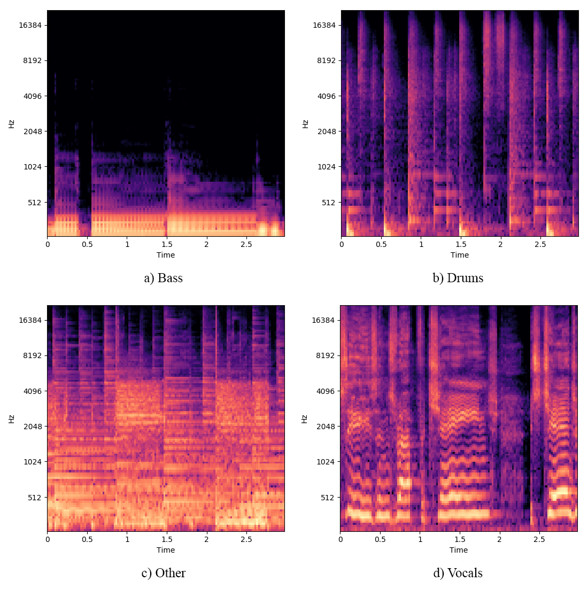

# MixCNN
Mulitrack mix leveling with convolutional neural nets.

## Setup

Install dependancies.

`$ pip install --upgrade -r requirements.txt`

Install python ITU-R BS.1770-4 loudness package.

```
$ git clone https://github.com/csteinmetz1/pyloudnorm.git
$ cd pyloudnorm
$ python setup.py install
```

## Dataset

Download and extract the DSD100 dataset: [http://liutkus.net/DSD100.zip](http://liutkus.net/DSD100.zip) (12 GB) 

Ensure that the extracted `DSD100` directory is placed in the top of the directory structure.

## Pre-process

To generate the input and output data run the `pre_process.py` script.

`$ python pre_process.py`

This will first measure the true mix loudness levels (and then calculate loudness ratios w.r.t the bass) which are saved to a .csv file. 
Then all of the stems are normalized to -24 LUFS.
Next melspectrograms with frame size 1024 and and hop length of the same size are generated of the normalized stems and stored in a pickle file. 

During training the melspectrograms of each subgroup is frammed with frame size of 128 (about 3 seconds of audio) and then stacked depth-wise to produce inputs of size 128x128x4. A single stack of TF-patches of length 128 are shown below for a single song in the data



## Train

To train the CNN model run the `train_cnn.py` script.

`$ python train_cnn.py`

